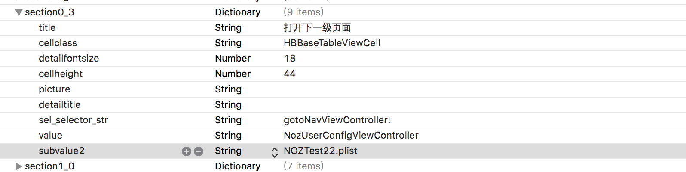
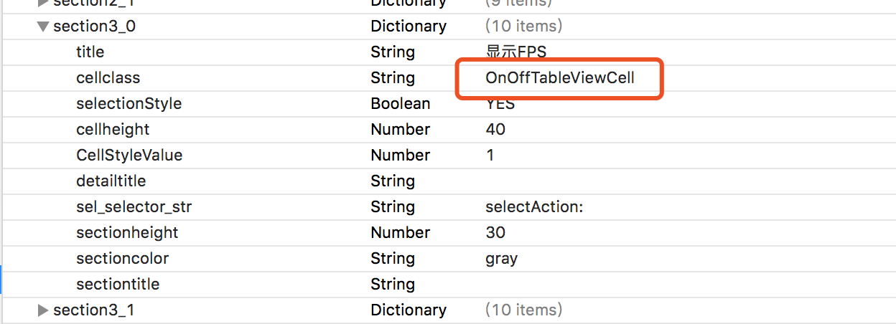
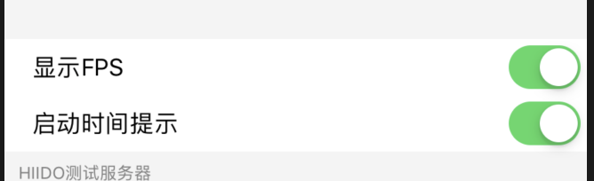

# 实验室使用方法

## 1. pod 引入实验室模块

```
    pod 'HBLaboratory' 
```

## 2. 在工程中构建UI - plist文件的创建
可以拷贝测试工程里面的 `demo/TestLab/TestLab/TesterRooterViewController.plist` 文件

## 3. 创建事件接受和定制数据模块 - Helper

创建 NOZLabHelper.h .m 单利
实现实验室`<NOZLaboratoryDataSource,NOZLaboratoryDelegate>
` 协议和代理


使用介绍 
> 1. 实验室通过UI配置，对应到了`NozUserConfigViewController` 的一个vc中，vc里面可以指定加载的plist，一个plist对应一个页面
> 2.先设置代理DataSource和delegate
> 3. 页面都是tableview，每一次cell的点击都会已通知和代理的形式发送过来，所以可以监听通知`klab_notify_name`，也可以实现代理 
> `- (void)lab_configSelectedWithNotifyObject:(NOZLabCallBackObject *)notifyobj`
> 4. 通知或代理出来是一个对象 `NOZLabCallBackObject` ，接收到这个可以实现自己要做的事情
> 5. 配置UID或其他数据可以使用DataSource `- (NSDictionary<NSString *,NSString *> *)lab_userConfigDictionary`  左边为实验室左侧的title右边为数据
> 6. 响应摇一摇打开实验室，实现 `- (BOOL)lab_shakeToShow`即可


具体代码如下

```
+ (void)load
{
    [NOZLabHelper sharedInstance];
}

+ (instancetype)sharedInstance
{
    static id sharedInstance = nil;
    static dispatch_once_t onceToken;
    dispatch_once(&onceToken, ^{
        sharedInstance = [[self alloc] init];
    });
    return sharedInstance;
}

- (instancetype)init
{
    self = [super init];
    if (self) {
        [NOZLaboratoryService sharedInstance].dataSource = self;
        [NOZLaboratoryService sharedInstance].delegate = self;
    }
    return self;
}


#pragma mark - datasource
- (NSDictionary<NSString *,NSString *> *)lab_userConfigDictionary
{
    
    return @{
             @"当前区域":@"中东",
             @"UID":@"12341242",
             @"HDID":@"666666",
             };
}
- (BOOL)lab_shakeToShow
{
    return YES;
}

- (void)showRootLab
{
    NozUserConfigViewController *ctr = [NozUserConfigViewController configWithPlistName:@"TesterRooterViewController" bundle:@""];
    ctr.modalPresentationStyle = UIModalPresentationOverFullScreen;
    [[[[UIApplication sharedApplication] keyWindow] noz_currentViewController] presentViewController:ctr animated:YES completion:nil];
    
}

#pragma mark - delegate

- (void)lab_configSelectedWithNotifyObject:(NOZLabCallBackObject *)notifyobj
{
    NOZLabCallBackObject *labobj = notifyobj;
    HBCellStruct *cs = labobj.notifycs;
    NSLog(@"收到实验室通知 %@ type: %@ param: %@",cs.title,labobj.notifyType,labobj.notifyParam);
    if ([labobj.class isSubclassOfClass:NOZLabCallBackObject.class]) {
        NSString *obj = labobj.notifyType;
        if ([obj.class isSubclassOfClass:NSString.class]) {
            
            NSString *str = labobj.notifyType;
            if ([str isEqualToString:klab_notifytype_showlab]) {
                [self showRootLab];
            }
            return;
        }
        
        if ([obj.class isSubclassOfClass:NSDictionary.class]) {
            //            NSDictionary *dic = labobj.notifyParam;
            
        }
        
    }
}

```

### 扩展方法

###  a. UI跳转指定的页面方法
* 创建对应的类，继承自HBBaseTableViewController
* 参考实验室那一项跳转方法

`sel_selector_str` 设为 `gotoNavViewController:`

`value` 设为 `NozUserConfigViewController`

`subvalue2` 设为  `NOZTest22.plist` 自己创建的



### b. 创建二值类型配置并保存
如要记录当前切换为测试环境，并且在下一次启动中生效，可以使用如下方法
在cellclass填入 `OnOffTableViewCell`




 