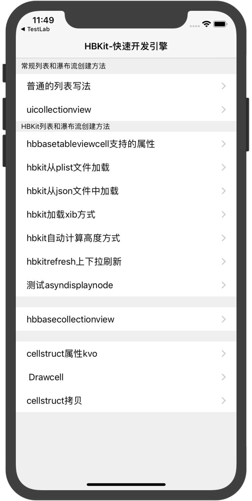

## HBKit 

* 使用plist或json文件创建一个列表
* 一行代码创建列表 

## 用法
 
 ```
 pod 'HBKit'
```

其他工程

```
 pod 'HBKitRefresh'  #添加上下拉刷新

 pod 'HBKitWatchDog' #添加watchdog 实时刷新 

 pod 'HBLaboratory' # 实验室模块
 
```


### 从plist文件加载

```objc
 
- (void)viewDidLoad
{
    [super viewDidLoad];
    // Do any additional setup after loading the view.
    [self loadplistConfig:@"TestPlist" watch_directory:@"resource"];
}

```

### 从json中加载

```objc
 
- (void)viewDidLoad {
    [super viewDidLoad]; 
    [self loadjsonfileConfig:@"TestJson" watch_directory:@"resource"]; 
}
```


### 代码加载





``` oc


@interface RootViewController ()
//step 1
 @property(nonatomic, retain) CELL_STRUCT *cell_struct_normal;
 @property(nonatomic, retain) CELL_STRUCT *cell_struct_sys;
 @property(nonatomic, retain) CELL_STRUCT *cell_struct_xib;
 @property(nonatomic, retain) CELL_STRUCT *cell_struct_plist;
 @property(nonatomic, retain) CELL_STRUCT *cell_struct_autoheight;
 @property(nonatomic, retain) CELL_STRUCT *cell_struct_refresh;
 @property(nonatomic, retain) CELL_STRUCT *cell_struct_normalcollection;
 @property(nonatomic, retain) CELL_STRUCT *cell_struct_collection;
 @property(nonatomic, retain) CELL_STRUCT *cell_struct_kvo;
 @property(nonatomic, retain) CELL_STRUCT *cell_struct_drawcell;
 @property(nonatomic, retain) CELL_STRUCT *cell_struct_copy;
 @property(nonatomic, retain) CELL_STRUCT *cell_struct_testjson;

@property(nonatomic, retain) CELL_STRUCT *cell_struct_testanode;

@end


@implementation RootViewController
DEF_CELL_STRUCT_WITH(testanode, @"测试asyndisplaynode");

- (void)viewDidLoad
{
    [super viewDidLoad];
    self.title = @"HBKit-快速开发引擎";
    [self loadCellstructConfig];
}

- (void)loadCellstructConfig
{
    
    NSInteger rowIndex = 0;
    NSInteger sectionIndex = 0;
    
    self.cell_struct_normal.sectionheight = 30;
    self.cell_struct_normal.sectiontitle = @"常规列表和瀑布流创建方法";
    [self.dataDictionary setObject:self.cell_struct_normal forKey:KEY_INDEXPATH(sectionIndex, rowIndex++)];
    [self.dataDictionary setObject:self.cell_struct_normalcollection forKey:KEY_INDEXPATH(sectionIndex, rowIndex++)];
    
    sectionIndex++,rowIndex = 0;
    self.cell_struct_sys.sectionheight = 20;
    self.cell_struct_sys.sectiontitle = @"HBKit列表和瀑布流创建方法";
    
    [self.dataDictionary setObject:self.cell_struct_sys forKey:KEY_INDEXPATH(sectionIndex, rowIndex++)];
    [self.dataDictionary setObject:self.cell_struct_plist forKey:KEY_INDEXPATH(sectionIndex, rowIndex++)];
    [self.dataDictionary setObject:self.cell_struct_testjson forKey:KEY_INDEXPATH(sectionIndex, rowIndex++)];
    [self.dataDictionary setObject:self.cell_struct_xib forKey:KEY_INDEXPATH(sectionIndex, rowIndex++)]; 
    [self.tableView reloadData];
}

/**
*  响应的CELselect的方法
*/
//step 3

- (IBAction)selectAction:(CELL_STRUCT *)cellstruct
{
    if (cellstruct == self.cell_struct_sys) {
        
        TestSystyleviewController *ctr = [[TestSystyleviewController alloc] init];
        [self.navigationController pushViewController:ctr animated:YES];
    }
    else if (cellstruct == self.cell_struct_xib) {
        TestXibViewController *ctr = [[TestXibViewController alloc] init];
        [self.navigationController pushViewController:ctr animated:YES];
    }
}

//step4 OK

``` 


